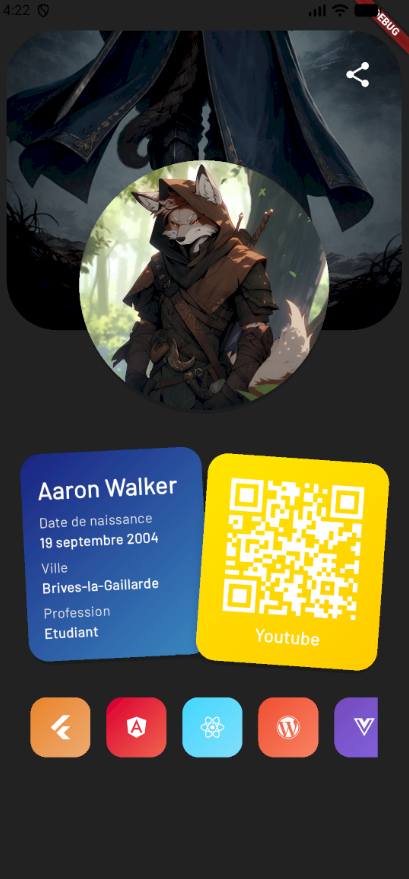

## TP1 - Projet Flutter: Page Profil
Ce dépôt contient le travail du TP1 pour le cours (semestre 6) : création d'une page "Profil" dans une application Flutter.

## But

Réaliser une page profil utilisateur simple affichant une image, le nom, et quelques informations basiques. L'image est fournie dans les assets et utilisée dans l'écran correspondant.

## Ce qui a été fait

- Création d'une page profil dans `lib/` (écran de profil).
- Intégration d'une image de profil dans `assets/images/profil.png` et utilisation dans l'écran ("screen app").
- Mise à jour des services de partie et de la navigation pour intégrer l'écran si nécessaire.

## Fichiers importants

- `lib/accueil_page.dart` : page d'accueil / point d'entrée vers les écrans.
- `lib/jeu_page.dart` : page principale du jeu (gestion des phases).
- `lib/jeu_page_nuit.dart` : écran de la phase de nuit.
- `lib/partie_service.dart` : logique de la partie et gestion des joueurs.
- `assets/images/profil.png` : image de profil utilisée dans l'application.

## Comment lancer l'application

1. Installer les dépendances :

```bash
flutter pub get
```

2. Lancer sur un émulateur ou un appareil connecté :

```bash
flutter run
```

## Remarques

- L'image de profil se trouve dans `screen app/profilpage.png` — vérifier que le chemin est déclaré dans `pubspec.yaml` si besoin.
- Ce TP est volontairement simple : si tu veux, je peux ajouter des champs éditables sur la page profil, sauvegarde locale ou animations.

---

Si tu veux une version plus détaillée (captures d'écran, instructions pour commits, livrable), dis-le et je complète.




